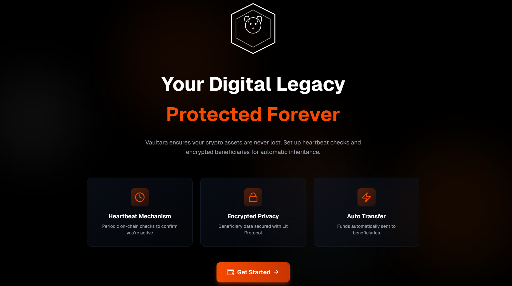
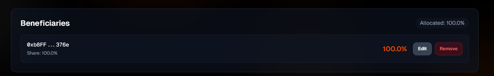
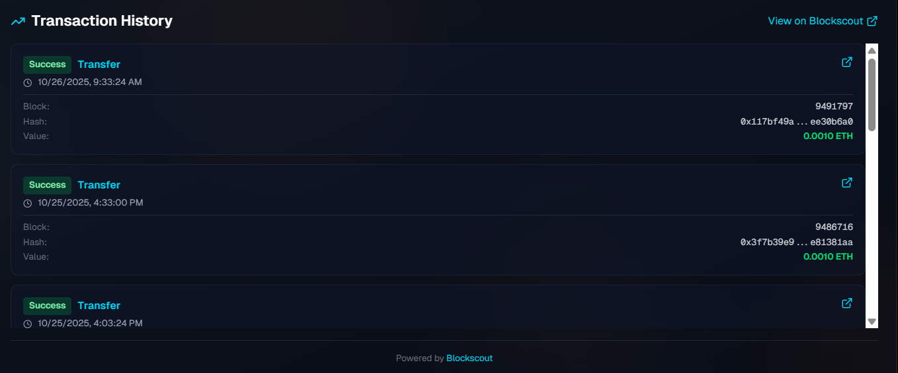

#  Vaultara - Self-Sovereign Crypto Inheritance

> **Never lose your crypto again.** Vaultara ensures your digital assets are automatically transferred to loved ones if something happens to you.

[](https://opensource.org/licenses/MIT)
[](https://soliditylang.org/)
[](https://hardhat.org/)
[](https://reactjs.org/)

[ Demo Video](#) | [ Live Demo](https://v0.app/chat/greeting-qJIU2xDcLwO?b=v0-preview-b_Znw7T7vfEta&path=%2F&f=1) | [ Smart Contract](https://eth-sepolia.blockscout.com/address/0xC11949532F5C46d567D254dCcFAd4BDC87f1306A)

---

##  The Problem

Every year, **billions of dollars** in cryptocurrency are permanently lost due to:

-  **Unexpected death** - No way to pass on assets
-  **Lost keys** - Private keys taken to the grave
-  **No contingency plan** - Families locked out forever
- **Centralized solutions** - Require trust in third parties

**$140+ billion** in Bitcoin alone is estimated to be lost forever. Your family deserves better.

---

##  The Solution: Vaultara

**Vaultara is a decentralized, trustless inheritance protocol** that ensures your crypto assets are never lost.

### How It Works

```
Set Heartbeat →  Add Beneficiaries → Fund Vault →  Stay Active →  Automatic Transfer (if needed)
```

**The Heartbeat Mechanism:**
- You set a timer (e.g., every 7 days)
- You send a heartbeat transaction to prove you're active
- If you fail to send heartbeat → Timer expires
- **Anyone** can trigger inheritance
- Smart contract **automatically distributes** funds to your beneficiaries

**No middlemen. No trust required. Fully on-chain.**

---

##  Key Features

### For Asset Owners

 **Self-Sovereign**: You control everything, no third parties  
 **Encrypted Privacy**: Beneficiary data encrypted with Lit Protocol  
 **Flexible Intervals**: Set heartbeat from 1 day to 1 year  
 **Multiple Beneficiaries**: Split assets by percentage  
 **Reversible**: Can deactivate and withdraw anytime  
 **Transparent**: All actions on-chain and verifiable  

### For Beneficiaries

 **Automatic Transfer**: No legal processes required  
 **Instant Access**: Funds transfer immediately when triggered  
 **Fair Distribution**: Pre-set percentages enforced by code  
**Privacy**: Identity encrypted until inheritance triggered  

### Technical Excellence

 **Battle-Tested Security**: OpenZeppelin contracts, reentrancy guards  
**Gas Optimized**: Custom errors, efficient storage  
 **48 Tests**: Comprehensive test coverage  
**Blockscout Verified**: Source code publicly verified  
 **Modern Stack**: Hardhat, React, TypeScript, Ethers.js  

---

##  Architecture

### Smart Contract Layer

```solidity
VaultaraInheritance.sol
├── Heartbeat Management
├── Beneficiary Management (encrypted)
├── Automatic Distribution Logic
├── Access Control (Ownable)
├── Security (ReentrancyGuard)
└── Event Logging
```

**Deployed on Sepolia**: `0xC11949532F5C46d567D254dCcFAd4BDC87f1306A`

### Frontend Layer

```typescript
React + TypeScript
├── Wallet Connection (MetaMask)
├── Contract Interactions (Ethers.js)
├── Encryption (Lit Protocol)
├── Transaction History (Blockscout SDK)
└── Real-time Dashboard
```

### Integration Layer

- **Lit Protocol**: Decentralized encryption for beneficiary privacy
- **Blockscout API**: Transaction history and on-chain verification
- **Hardhat**: Development, testing, and deployment framework

---

##  Demo Flow

### User Journey

1. **Connect Wallet** 
   - Connect MetaMask to Sepolia testnet
   
2. **Initialize Vault**
   - Set heartbeat interval (e.g., 7 days)
   - Smart contract deployed and activated

3. **Add Beneficiaries**
   - Enter beneficiary addresses
   - Set share percentages (must total 100%)
   - Data encrypted with Lit Protocol
   - Stored on-chain

4. **Fund the Vault**
   - Deposit ETH into contract
   - Funds held securely

5. **Send Heartbeats**
   - Periodic on-chain transactions
   - Resets the countdown timer
   - Proves owner is active

6. **Inheritance Trigger** (if heartbeat expires)
   - Timer reaches zero
   - Anyone calls `triggerInheritance()`
   - Smart contract automatically:
     - Distributes funds by percentage
     - Sends ETH to all beneficiaries
     - Marks vault as completed

---

##  Technology Stack

| Layer | Technology | Purpose |
|-------|------------|---------|
| **Smart Contracts** | Solidity 0.8.20 | Core inheritance logic |
| **Testing** | Hardhat + Mocha | 48 comprehensive tests |
| **Frontend** | React + TypeScript | User interface |
| **Styling** | Tailwind CSS | Modern, responsive design |
| **Web3** | Ethers.js v6 | Blockchain interaction |
| **Encryption** | Lit Protocol | Beneficiary privacy |
| **Verification** | Blockscout | Transaction transparency |
| **Security** | OpenZeppelin | Audited contract libraries |

---

##  Project Structure

```
vaultara-inheritance/
├── vaultara_backend/        # Backend (Hardhat)
│   ├── contracts/
│   │   └── VaultaraInheritance.sol
│   ├── test/
│   │   └── VaultaraInheritance.test.ts
│   ├── scripts/
│   ├── ignition/
│   └── hardhat.config.ts
│
├── vaultara-frontend/           # Frontend (React)
│   ├── src/
│   │   ├── components/
│   │   │   ├── Dashboard.tsx
│   │   │   └── TransactionHistory.tsx
│   │   ├── hooks/
│   │   │   ├── useWallet.ts
│   │   │   ├── useVaultaraContract.ts
│   │   │   ├── useLitProtocol.ts
│   │   │   └── useBlockscout.ts
│   │   ├── contracts/
│   │   │   ├── VaultaraInheritance.json
│   │   │   └── config.ts
│   │   └── App.tsx
│   └── vite.config.ts
│
└── README.md                    # This file
```

---

##  Quick Start

### Prerequisites

- Node.js >= 18.0.0
- MetaMask wallet
- Sepolia testnet ETH ([Get from faucet](https://sepoliafaucet.com/))

### Backend Setup

```bash
cd vaultara_backend
npm install
npx hardhat compile
npx hardhat test
```

### Frontend Setup

```bash
cd vaultara-frontend
npm install
npm run dev
```

### Access the App

Open `http://localhost:5173` and connect your MetaMask wallet!

---

##  Smart Contract Functions

### Owner Functions
- `initializeVault(uint256 interval)` - Start the vault
- `sendHeartbeat()` - Prove you're active
- `addBeneficiary(address, uint256, string)` - Add encrypted beneficiary
- `updateBeneficiary(address, uint256)` - Update share percentage
- `removeBeneficiary(address)` - Remove a beneficiary
- `deactivateVault()` - Stop the vault
- `withdrawFunds()` - Withdraw when inactive

### Public Functions
- `triggerInheritance()` - Anyone can trigger (when expired)
- `isHeartbeatExpired()` - Check expiry status
- `getActiveBeneficiaries()` - View beneficiaries (encrypted)
- `getTimeUntilExpiry()` - Time remaining

---

##  Screenshots

### Home Page View

*Home page of Vaultara*
### Dashboard View

*Real-time vault status with countdown timer*

### Beneficiary Management

*Add and manage beneficiaries with encrypted data*

### Transaction History

*Live feed from Blockscout showing all vault activity*

---

##  Testing

### Smart Contract Tests

```bash
cd vaultara-inheritance
npx hardhat test
```

**Coverage:**
-  48 tests passing
-  Deployment scenarios
-  Vault initialization
-  Heartbeat mechanism
-  Beneficiary management
-  Inheritance triggering
-  Security edge cases
-  Access control

### Frontend Testing

```bash
cd vaultara-frontend
npm run build
```

Manual testing checklist:
-  Wallet connection
-  Network switching
-  Contract interactions
-  Transaction confirmations
-  Error handling
-  Responsive design

---

##  Security Features

### Smart Contract Security

1. **OpenZeppelin Libraries**
   - ReentrancyGuard for attack prevention
   - Ownable for access control

2. **Input Validation**
   - Heartbeat interval: 1-365 days
   - Share percentages: Must total 100%
   - Beneficiary addresses validated

3. **Custom Errors**
   - Gas-efficient error handling
   - Clear error messages

4. **Event Logging**
   - Complete audit trail on-chain
   - All actions logged

### Frontend Security

1. **No Private Keys Stored**
   - MetaMask handles all signing
   
2. **Input Sanitization**
   - Form validation
   - Type checking

3. **Secure Encryption**
   - Lit Protocol for beneficiary data
   - Owner-only decryption

---

##  Deployment

### Current Deployment

- **Network**: Sepolia Testnet
- **Contract**: `0xC11949532F5C46d567D254dCcFAd4BDC87f1306A`
- **Verified**:  [View on Blockscout](https://eth-sepolia.blockscout.com/address/0xC11949532F5C46d567D254dCcFAd4BDC87f1306A)

### Deploy Your Own

```bash
# Backend
cd vaultara-inheritance
npx hardhat ignition deploy ignition/modules/VaultaraInheritance.ts --network sepolia

# Frontend (update contract address in config.ts)
cd vaultara-frontend
npm run build
vercel deploy
```

---

##  Current Limitations (MVP)

This is a **hackathon prototype**. Production considerations:

 **Single Vault Per Contract**: One vault per deployed contract  
 **Testnet Only**: Currently on Sepolia testnet  
 **No Multi-sig**: Single owner model  
 **No Guardians**: No fallback if beneficiaries lost access  
 **Basic Encryption**: Simplified Lit Protocol implementation  

---

##  Future Enhancements

### V2.0 Roadmap

1. **Factory Pattern**
   - Deploy individual vaults per user
   - Registry of all vaults
   - Gas-efficient deployment

2. **Multi-chain Support**
   - Ethereum mainnet
   - Polygon, Arbitrum, Optimism
   - Cross-chain inheritance

3. **Advanced Features**
   - Multi-sig vaults
   - Guardian system (trusted contacts)
   - Conditional triggers (beyond time)
   - NFT inheritance
   - Token inheritance (ERC20)

4. **Enhanced Privacy**
   - Full Lit Protocol integration
   - Zero-knowledge proofs
   - Private beneficiary identity

5. **User Experience**
   - Email/SMS notifications
   - Mobile app
   - Social recovery
   - Beneficiary portal

6. **Enterprise Features**
   - Corporate treasury management
   - DAO inheritance
   - Trust fund automation
   - Legal document storage

---

##  Business Model (Future)

Potential revenue streams:

1. **Subscription Model**: Annual fee per vault
2. **Transaction Fees**: Small % on inheritance trigger
3. **Premium Features**: Advanced security, multi-sig
4. **Enterprise Plans**: Corporate solutions
5. **White-label**: API for other platforms

---

##  Market Opportunity

### Total Addressable Market

- **Crypto Holders**: 420M+ worldwide
- **High Net Worth**: 60M+ crypto millionaires by 2030
- **Estate Planning**: $100B+ industry
- **Lost Crypto**: $140B+ (Bitcoin alone)

### Target Users

1. **Long-term Holders** (HODLers)
2. **High Net Worth Individuals**
3. **Family-oriented Investors**
4. **Elderly Crypto Investors**
5. **Institutional Treasuries**

---

##  Hackathon Category

**Best Use of:**
-  Lit Protocol (Encryption)
-  Blockscout (Verification)
-  Hardhat (Development)
-  Decentralized Finance (DeFi)
-  Social Impact (Financial Inclusion)

---

##  Team

Built by [Ravi Shankar Kumar](https://x.com/RaviShanka5139) for the hackathon.

**Skills Used:**
- Smart Contract Development (Solidity)
- Full-stack Web3 Development
- Frontend Engineering (React/TypeScript)
- Blockchain Security
- UI/UX Design

---

##  License

MIT License

This is open-source software. Feel free to:
- Use for personal/commercial projects
- Modify and improve
- Contribute back to community

---

##  Acknowledgments

- **OpenZeppelin**: Security contract libraries
- **Hardhat**: Development framework
- **Lit Protocol**: Decentralized encryption
- **Blockscout**: Open-source block explorer
- **Ethereum Community**: For building the future

---

##  Contact & Links

- **GitHub**: [Repository Link](https://github.com/RSKKSOFFICIAL/Vaultara)
- **Demo Video**: [YouTube Link]
- **Live Demo**: [Vercel Deployment](https://v0.app/chat/greeting-qJIU2xDcLwO?b=v0-preview-b_Znw7T7vfEta&path=%2F&f=1)

---

##  Try It Now!

1. Get Sepolia ETH from [faucet](https://sepoliafaucet.com/)
2. Visit [Live Demo](https://v0.app/chat/greeting-qJIU2xDcLwO?b=v0-preview-b_Znw7T7vfEta&path=%2F&f=1)
3. Connect MetaMask
4. Initialize your vault
5. Add beneficiaries
6. Fund and test!

---

##  Star This Repo!

If you believe in never losing crypto again, give us a star ⭐

**Let's make crypto inheritance accessible to everyone.**

---

<div align="center">

**Built with ❤️ for the Web3 Community by [Ravi Shankar Kumar](https://x.com/RaviShanka5139)**

[Star](https://github.com/RSKKSOFFICIAL/Vaultara) | [ Report Bug](https://github.com/RSKKSOFFICIAL/Vaultara/issues) | [ Request Feature](https://github.com/RSKKSOFFICIAL/Vaultara/issues)

</div>